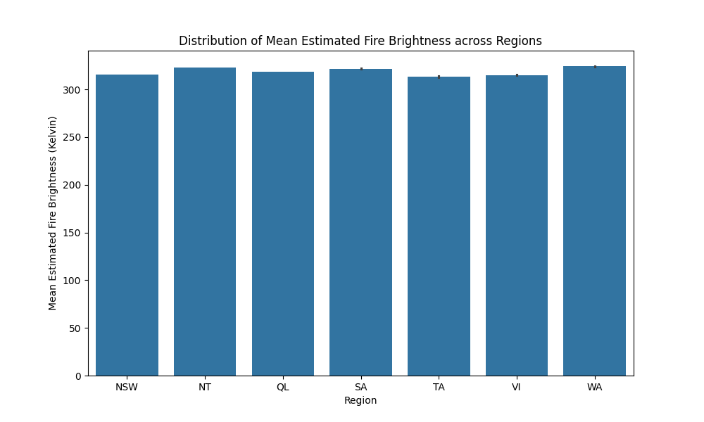
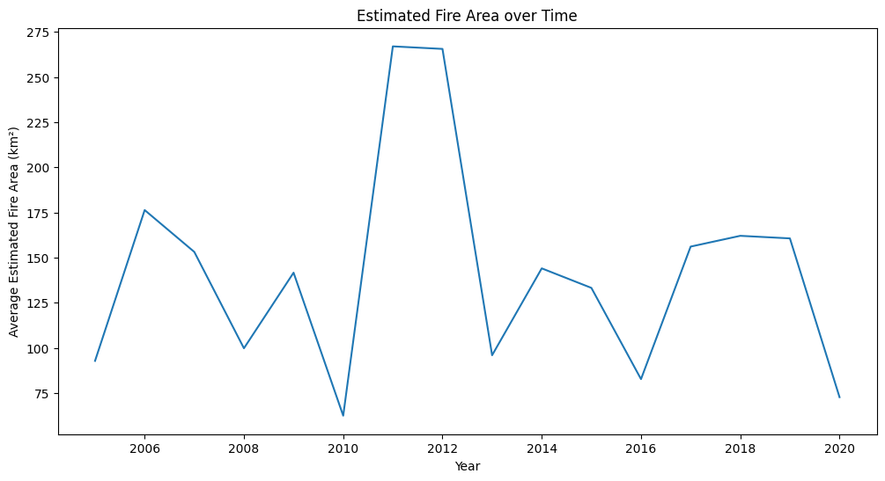
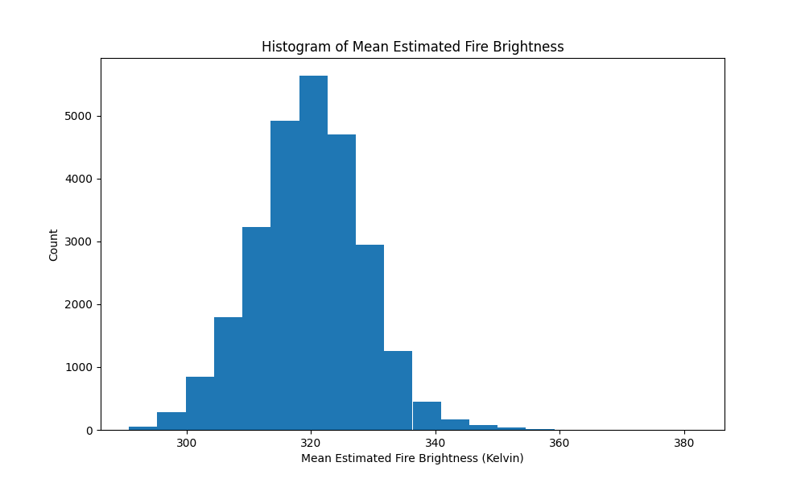
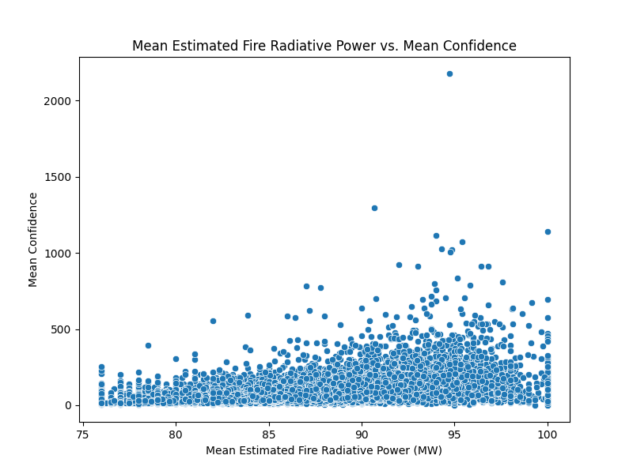
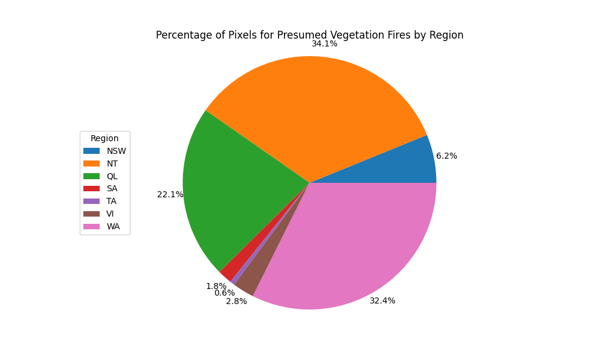

# Comprehensive Analysis of Australian Wildfire Trends

## Project Overview
This project focuses on performing an **Exploratory Data Analysis (EDA)** on historical wildfire data in Australia. By leveraging data cleaning and advanced visualization techniques, the analysis aims to uncover patterns in fire intensity, frequency, and regional distribution over the last two decades. Understanding these trends is critical for environmental monitoring and developing proactive fire management strategies.

---

## Dataset Overview
The analysis utilizes a comprehensive dataset documenting wildfire activities across different Australian regions. The data includes the following key attributes:
*   **Temporal Data**: Date, Month, and Year of fire incidents.
*   **Intensity Metrics**: Estimated fire area ($km^2$), Fire Radiative Power (MW), and Fire Brightness (Kelvin).
*   **Geographical Data**: Regional identifiers (e.g., NSW, NT, QL, WA).
*   **Metadata**: Confidence levels and pixel counts for presumed vegetation fires.

---

## Data Cleaning & Preprocessing
To ensure analytical accuracy, the following preprocessing steps were performed:
*   **Duplicate Removal**: Identified and removed redundant entries to prevent statistical bias.
*   **Missing Value Handling**: Imputed or removed null values in critical columns like `Estimated_fire_area`.
*   **Temporal Feature Engineering**: Extracted `Year` and `Month` from date strings to facilitate time-series analysis.
*   **Normalization**: Standardized naming conventions for regions and ensured numerical columns were in correct floating-point formats.

---

## Exploratory Data Analysis (EDA)

### 1. Fire Intensity by Region

*   **Description**: A bar chart comparing the mean estimated fire brightness across various Australian regions.
*   **Commentary**: The visualization indicates that fire brightness (intensity) remains relatively consistent across major regions, though Northern Territory (NT) and Western Australia (WA) show slightly higher mean temperatures, suggesting more intense thermal events in those areas.

### 2. Longitudinal Trend of Fire Area

*   **Description**: A line graph showing the average estimated fire area ($km^2$) from 2005 to 2020.
*   **Commentary**: There is a significant spike in the average fire area around 2011-2012. While subsequent years show lower averages, the periodic peaks suggest a cyclical nature to large-scale wildfire events in Australia.

### 3. Distribution of Fire Brightness

*   **Description**: A histogram showing the frequency distribution of mean estimated fire brightness.
*   **Commentary**: The data follows a near-normal distribution centered around **320 Kelvin**. Most fire events fall within the 310K to 330K range, with very few extreme high-intensity outliers exceeding 360K.

### 4. Correlation: Radiative Power vs. Confidence

*   **Description**: A scatter plot illustrating the relationship between Fire Radiative Power (MW) and the Mean Confidence level.
*   **Commentary**: There is a dense clustering at lower radiative power levels. As the radiative power increases, the confidence level typically remains high, suggesting that more intense fires are easier to detect and confirm via satellite imaging.

### 5. Regional Distribution of Fire Pixels

*   **Description**: A pie chart showing the percentage of pixels for presumed vegetation fires by region.
*   **Commentary**: The **Northern Territory (NT) at 34.1%** and **Western Australia (WA) at 32.4%** account for the vast majority of fire-related pixel detections, indicating these regions are the most frequent hotspots for wildfire activity.

---

## Key Insights
*   **Dominant Regions**: NT and WA are the primary contributors to wildfire activity in Australia, together accounting for over **66%** of all detected fire pixels.
*   **Cyclical Peaks**: Fire area peaks approximately every 7-9 years, suggesting that long term climatic cycles (like El Niño) may influence wildfire scales.
*   **Intensity Consistency**: While the *area* of fires varies significantly by year, the *brightness* (temperature) remains fairly stable, indicating consistent fuel types and burning conditions across the continent.
*   **Detection Accuracy**: High intensity fires (high Radiative Power) consistently correlate with high confidence levels, validating the reliability of the satellite monitoring data.

---

## Tools and Libraries
*   **Python**: Core programming language.
*   **Pandas**: Data manipulation and cleaning.
*   **Matplotlib & Seaborn**: Statistical data visualization.
*   **Folium**: Geographical mapping and spatial analysis.
*   **NumPy**: Numerical computing.

---

## How to Run the Project
1.  **Clone the Repository**:
    ```bash
    git clone https://github.com/yourusername/australian-wildfire-analysis.git
    ```
2.  **Install Dependencies**:
    ```bash
    pip install pandas matplotlib seaborn folium
    ```
3.  **Run the Notebook**: Open `Analyzing wildfire activities in Australia.ipynb# Comprehensive Analysis of Australian Wildfire Trends
4.  **View Dashboard**: Run `python Dash_wildfire.py` to launch the interactive dashboard in your browser.
    

---

## Conclusion
This analysis successfully mapped the landscape of Australian wildfires over a 15-year period. By identifying NT and WA as high-risk zones and highlighting the cyclical nature of fire areas, this project provides a foundation for predictive modeling. The consistency in fire brightness suggests that while the scale of fires changes, the underlying thermal characteristics are predictable, allowing for standardized fire-response protocols.
